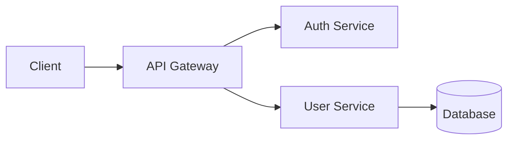

# Document Command

**Description**: Generate comprehensive, clear documentation for code, APIs, and systems.

## When to Use

Use this command to:
- Document public APIs
- Create README files
- Write technical guides
- Generate API documentation
- Document architecture decisions
- Create onboarding guides
- Write changelogs

## Documentation Types

### 1. README Documentation

**Essential sections**:

```markdown
# Project Name

[One-sentence description]

## Features

- Feature 1
- Feature 2
- Feature 3

## Installation

```bash
npm install project-name
```

## Quick Start

```javascript
import { main } from 'project-name';

main();
```

## Usage

### Basic Example

```javascript
// Complete working example
```

### Advanced Example

```javascript
// More complex usage
```

## API Reference

See [API.md](./docs/API.md)

## Configuration

```javascript
{
  option1: 'value',
  option2: 'value'
}
```

## Development

```bash
# Install dependencies
npm install

# Run tests
npm test

# Build
npm run build
```

## Contributing

See [CONTRIBUTING.md](./CONTRIBUTING.md)

## License

MIT
```

### 2. API Documentation

**Function documentation (JSDoc/TSDoc)**:

```typescript
/**
 * Authenticates a user with email and password.
 *
 * @param email - User's email address
 * @param password - User's password (will be hashed for comparison)
 * @param options - Optional authentication options
 * @param options.rememberMe - Keep user logged in for extended period
 * @param options.mfa - Multi-factor authentication token
 *
 * @returns Authentication result with token and user data
 * @throws {ValidationError} If email or password is invalid
 * @throws {AuthenticationError} If credentials don't match
 * @throws {AccountLockedError} If account is locked due to failed attempts
 *
 * @example
 * ```typescript
 * const result = await authenticateUser(
 *   'user@example.com',
 *   'securePassword123',
 *   { rememberMe: true }
 * );
 * console.log(result.token); // JWT token
 * console.log(result.user);  // User object
 * ```
 *
 * @example
 * ```typescript
 * // With MFA
 * const result = await authenticateUser(
 *   'user@example.com',
 *   'password',
 *   { mfa: '123456' }
 * );
 * ```
 *
 * @see {@link createUser} for user registration
 * @see {@link refreshToken} for token renewal
 *
 * @since 1.0.0
 * @public
 */
export async function authenticateUser(
  email: string,
  password: string,
  options?: AuthOptions
): Promise<AuthResult> {
  // implementation
}
```

**Class documentation**:

```typescript
/**
 * Manages user sessions and authentication state.
 *
 * @remarks
 * This class handles session creation, validation, and expiration.
 * Sessions are stored in Redis with automatic expiration.
 *
 * @example
 * ```typescript
 * const sessionManager = new SessionManager(redisClient);
 *
 * // Create session
 * const session = await sessionManager.create(userId, {
 *   expiresIn: '7d'
 * });
 *
 * // Validate session
 * const isValid = await sessionManager.validate(session.id);
 *
 * // Destroy session
 * await sessionManager.destroy(session.id);
 * ```
 *
 * @public
 */
export class SessionManager {
  /**
   * Creates a new session manager.
   *
   * @param redisClient - Redis client instance for session storage
   * @param options - Optional configuration
   */
  constructor(
    private redisClient: Redis,
    private options?: SessionManagerOptions
  ) {}

  /**
   * Creates a new session for a user.
   *
   * @param userId - ID of the user to create session for
   * @param options - Session creation options
   * @returns Created session with ID and expiration
   */
  async create(
    userId: string,
    options?: CreateSessionOptions
  ): Promise<Session> {
    // implementation
  }
}
```

### 3. Architecture Documentation

**ADR (Architecture Decision Record)**:

```markdown
# ADR 001: Use PostgreSQL for Primary Database

## Status

Accepted

## Context

We need to choose a primary database for our application. Requirements:
- ACID compliance for financial transactions
- Complex relational data (users, orders, products, inventory)
- Strong consistency guarantees
- Good TypeScript/Node.js support
- Scalable to millions of records

## Decision

Use PostgreSQL as the primary database.

## Consequences

### Positive
- Battle-tested ACID compliance
- Rich query capabilities (JOINs, aggregations, CTEs)
- JSON support for flexible fields
- Excellent TypeScript/Node.js libraries (pg, Prisma, TypeORM)
- Wide ecosystem and community support
- Good performance for complex queries
- Strong data integrity guarantees

### Negative
- More complex setup than document databases
- Requires schema migrations
- Vertical scaling limitations (though significant)
- More expensive than some NoSQL options

### Neutral
- Need to learn SQL if team unfamiliar
- Requires careful index management for performance

## Alternatives Considered

### MongoDB
- **Pros**: Flexible schema, easy to start
- **Cons**: Weaker consistency guarantees, less suitable for relational data
- **Why not**: Our data is inherently relational (orders → users, products → categories)

### MySQL
- **Pros**: Similar to PostgreSQL, widely known
- **Cons**: Less feature-rich, weaker JSON support
- **Why not**: PostgreSQL offers better feature set with similar trade-offs

## Implementation

- Use Prisma as ORM for type-safe queries
- Set up master-replica for read scaling
- Use connection pooling (PgBouncer)
- Regular backups to S3

## Related Decisions

- ADR 002: Use Prisma as ORM
- ADR 003: Redis for caching

## References

- [PostgreSQL Documentation](https://www.postgresql.org/docs/)
- [Database Benchmarks](internal-link)
```

### 4. Inline Code Comments

**When to comment**:
- Complex algorithms
- Non-obvious business logic
- Workarounds and hacks
- "Why" not "what"

**Examples**:

```typescript
// ❌ Bad: Comments the obvious
// Increment counter by 1
counter++;

// ✅ Good: Explains why
// Use exponential backoff to avoid overwhelming the API
// after rate limit errors (429 responses)
await sleep(Math.pow(2, retryCount) * 1000);

// ✅ Good: Explains complex logic
// We must check permissions before checking existence
// to avoid leaking information about private resources
// (timing attacks could reveal if private resource exists)
if (!hasPermission(user, resourceId)) {
  throw new NotFoundError(); // Not "Forbidden"
}
```

### 5. Changelog

**Format (Keep a Changelog)**:

```markdown
# Changelog

All notable changes to this project will be documented in this file.

The format is based on [Keep a Changelog](https://keepachangelog.com/en/1.0.0/),
and this project adheres to [Semantic Versioning](https://semver.org/spec/v2.0.0.html).

## [Unreleased]

### Added
- New feature X

### Changed
- Improved performance of Y

### Deprecated
- Function Z (use Z2 instead)

### Removed
- Old API endpoint /v1/legacy

### Fixed
- Bug in authentication flow

### Security
- Patched XSS vulnerability in search

## [1.2.0] - 2026-02-13

### Added
- User profile customization
- Dark mode support
- Export to PDF functionality

### Changed
- Updated authentication to use JWT instead of sessions
- Improved error messages for validation failures

### Fixed
- Race condition in order processing
- Memory leak in WebSocket connections

## [1.1.0] - 2026-01-15

### Added
- Two-factor authentication
- Email notifications

### Fixed
- Login redirect loop on mobile

## [1.0.0] - 2025-12-01

Initial release

[Unreleased]: https://github.com/user/repo/compare/v1.2.0...HEAD
[1.2.0]: https://github.com/user/repo/compare/v1.1.0...v1.2.0
[1.1.0]: https://github.com/user/repo/compare/v1.0.0...v1.1.0
[1.0.0]: https://github.com/user/repo/releases/tag/v1.0.0
```

### 6. User Guides

**Tutorial structure**:

```markdown
# Getting Started with [Feature]

## What You'll Learn

In this guide, you'll learn how to:
- Set up [feature]
- Perform basic operations
- Handle common scenarios
- Troubleshoot issues

## Prerequisites

- Node.js 18+
- Basic understanding of TypeScript
- Account on [service]

## Step 1: Installation

```bash
npm install package-name
```

Expected output:
```
+ package-name@1.2.0
added 15 packages
```

## Step 2: Configuration

Create a config file `config.json`:

```json
{
  "apiKey": "your-api-key",
  "environment": "development"
}
```

## Step 3: Basic Usage

Create a new file `app.ts`:

```typescript
import { Client } from 'package-name';

const client = new Client({
  apiKey: process.env.API_KEY
});

async function main() {
  const result = await client.doSomething();
  console.log(result);
}

main();
```

Run it:
```bash
npm run start
```

Expected output:
```
{ success: true, data: [...] }
```

## Step 4: Advanced Features

[More complex examples]

## Common Issues

### Issue: "API key invalid"

**Cause**: API key not properly configured

**Solution**:
1. Check your .env file
2. Verify the key format
3. Ensure no extra whitespace

### Issue: "Connection timeout"

**Cause**: Network or firewall issues

**Solution**:
1. Check internet connection
2. Verify firewall settings
3. Try increasing timeout value

## Next Steps

- Read the [API Reference](./API.md)
- Check out [Advanced Topics](./ADVANCED.md)
- Join our [Discord community](https://discord.gg/...)

## Related Guides

- [Authentication Guide](./AUTH.md)
- [Deployment Guide](./DEPLOY.md)
```

## Documentation Best Practices

### DO:
✅ Write for your audience (beginner vs expert)
✅ Include working code examples
✅ Show expected output
✅ Explain the "why" not just "how"
✅ Keep docs up to date with code
✅ Use consistent terminology
✅ Include troubleshooting section
✅ Add visual aids (diagrams, screenshots)
✅ Link to related documentation
✅ Version your documentation

### DON'T:
❌ Assume prior knowledge
❌ Use vague descriptions
❌ Include incomplete examples
❌ Let documentation get stale
❌ Document implementation details
❌ Write walls of text
❌ Skip error scenarios
❌ Use jargon without explanation

## Documentation Tools

### API Documentation Generators

```bash
# TypeScript (TSDoc)
npx typedoc src/

# JavaScript (JSDoc)
npx jsdoc src/ -d docs/

# OpenAPI/Swagger
npx swagger-jsdoc -d swaggerDef.js src/**/*.ts -o swagger.json

# Markdown from code
npx documentation build src/** -f md -o API.md
```

### Diagram Tools

```markdown
# Mermaid (in Markdown)


# PlantUML
@startuml
actor User
User -> API: Request
API -> Database: Query
Database -> API: Response
API -> User: Data
@enduml
```

## Documentation Checklist

Before publishing documentation:

- [ ] All code examples are tested and work
- [ ] Links are valid and not broken
- [ ] Spelling and grammar checked
- [ ] Screenshots/diagrams up to date
- [ ] Version numbers correct
- [ ] Prerequisites clearly listed
- [ ] Troubleshooting section included
- [ ] Related docs cross-referenced
- [ ] Examples show best practices
- [ ] Security considerations noted

## Documentation Maintenance

### Review Cycle

```markdown
- After each release: Update changelog
- Monthly: Review for accuracy
- Quarterly: Major documentation review
- When code changes: Update affected docs immediately
```

### Track Documentation Debt

```markdown
## Documentation TODOs

- [ ] Add examples for advanced auth patterns
- [ ] Document webhook setup
- [ ] Create migration guide from v1 to v2
- [ ] Add performance tuning guide
- [ ] Document disaster recovery procedures
```

## After Documenting

- Add docs to README
- Link from main documentation index
- Announce in team channels
- Consider blog post for major features
- Update related documentation
